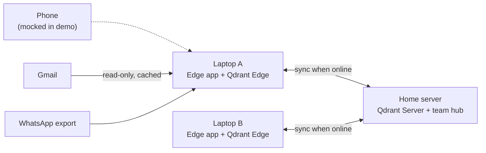
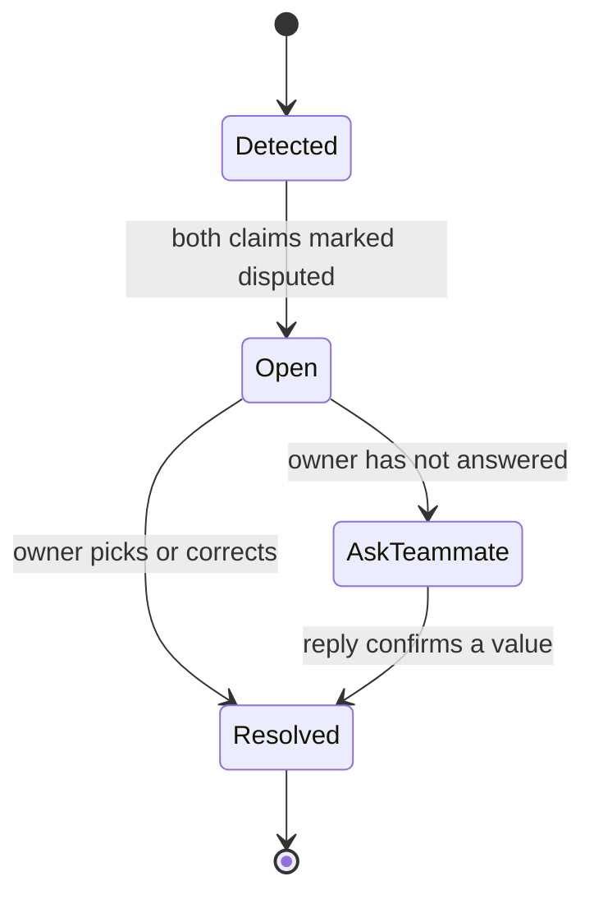

# Quorum: Offline-First Team Memory on Qdrant Edge

> **Your team's memory, on every laptop, even with no signal.**
> It reads everything, and nothing leaves unless it's work your team needs.
> When two people disagree about a deadline, it asks instead of guessing.

**Code Cubicle 6.0 · Problem Statement 03: AI-Powered Edge Memory & Intelligence (Qdrant Edge)**

🎬 **Showcase video:** [`video/quorum-showcase.mp4`](video/quorum-showcase.mp4)

---

## The problem

Small field teams (film crews, event teams, agencies, site crews) juggle many clients across email, WhatsApp and conversations on set, often somewhere with no network. A deadline gets changed in one place and misquoted in another. Nobody notices until it's too late.

Cloud assistants don't help here. They need a connection, and to be useful they would have to read everything: your email, your chats, what's on your screen. That data shouldn't leave the device.

## What Quorum is

**A shared, offline-first memory layer for small teams.** Each member's laptop is a full edge node:

- **Remembers** what each person was told (email, WhatsApp exports, typed notes), and every fact is stored as a **claim with a source**, never as bare truth.
- **Works with zero signal.** Hybrid search, extraction and answers all run on-device.
- **Syncs when it reconnects** through a persistent outbox that survives restarts.
- **Never silently picks a winner.** When two teammates' facts disagree, Qdrant surfaces the conflict and the task's owner resolves it.

Each member uses it through a personal assistant built on top of the layer. The **memory layer is the submission**; the assistant is the showcase.

## Architecture



| Component | Runs on | Stack |
| --- | --- | --- |
| Edge app shell | Laptop | Tauri (Rust + TypeScript) |
| Vector memory | Laptop | `qdrant-edge` (Rust crate; Python bindings as fallback) |
| Embeddings | Laptop | FastEmbed on-device: dense + BM25 sparse for hybrid search |
| Graph + outbox | Laptop | SQLite: entities, relations, claims, persistent sync queue |
| Local LLM | Laptop | llama.cpp / Ollama with constrained (grammar/JSON-schema) output |
| Sync hub | Home server | Qdrant Server (Docker), holding only the *my-devices* and *team* tiers |

## Memory model: claims, not facts

```json
{
  "claim_id": "clm_01J...",
  "entity_id": "task_sharma_edit",
  "attribute": "due_date",
  "value": "2026-10-16",
  "source": {"kind": "email", "ref": "gmail:18f2...", "author": "client:sharma"},
  "stated_at": "2026-10-03T11:20:00+05:30",
  "captured_by": "lakshya",
  "device_id": "dev_lakshya_laptop",
  "tier": "team",
  "status": "active",
  "conflict_id": null,
  "version": 1
}
```

- **Graph (SQLite):** Person, Project, Task, Event, Source, with relations OWNS, DUE_ON, ASSIGNED_TO, MENTIONED_IN, ABOUT.
- **Vectors (Qdrant Edge):** every claim and source message is a point with named vectors (dense + BM25 sparse). Payload carries entity, attribute, tier, status.
- `status` ∈ `active | disputed | superseded | retracted`. Superseded claims are kept, so history stays traceable.

### Qdrant does the conflict detection
When a new claim arrives, a **hybrid search filtered by attribute and active status** retrieves existing claims about the same thing. A close match with a different value opens a conflict:

> *"Found 2 claims about the Sharma delivery, similarity 0.91. Dates disagree."*

### Qdrant enforces privacy
Every search carries a **payload filter on tier**, so shared views can never surface device-only claims.

## Sync tiers

| Tier | Stored on | Syncs to | Examples |
| --- | --- | --- | --- |
| Device only | This device | Nowhere | Personal finances, window titles, friends' private news |
| My devices | My devices + hub | My other devices | Personal schedule, birthdays |
| Team | All team devices + hub | Whole team | Client deadlines, deliverables, shoot schedules |

Everything starts **device-only**. A claim moves up a tier only when the local model classifies it that way; anything it's unsure about stays on the device.
**Up-sync:** dual write, local store plus a persistent outbox drained by a background worker with retries. **Down-sync:** partial snapshots, so only changed segments are sent.

## Conflict handling



- Detected **at ingest** (a new claim contradicts a local one) and **at sync** (claims made on separate offline devices meet for the first time).
- The **task owner** is asked. While a conflict is open, every answer shows both versions and their sources: *"Disputed. The client's email says the 16th; you said the 18th on set."*
- If the owner doesn't answer, the assistant offers *"Should I ask Lakshya?"*, drafts the message, and **sends only on yes**.
- On resolution, the chosen claim becomes active, the other is superseded, and the resolution itself is stored as a claim.

## Proactive behaviours

| Behaviour | Example |
| --- | --- |
| Hyperfocus nudge | "You've been on the game project since 2. The Sharma edit is due tomorrow at 10." |
| Deadline reminder | "Reel cutdowns due Monday. Three, not two, per the client's last message." |
| Person fact | "Riya's birthday is Thursday." |
| Pattern | "You usually forget invoices on Fridays. Want a reminder at 4?" |

## Privacy by construction

1. **No leaks through team sync:** tier filters on every Qdrant search.
2. **Encrypted at rest:** memory, graph and outbox.
3. **No cloud calls in the private path:** extraction, classification and answers all run on the local model.

## Interface

Memory point cloud (claims in 3D by meaning, coloured local / queued / synced / conflicted) · Assistant panel with cited sources · Memory inspector · Conflict centre (side-by-side evidence + Qdrant similarity) · Sync status · Activity timeline · Live network monitor proving offline operation.

## Real vs mocked (we're upfront about this)

| Real | Mocked for the demo |
| --- | --- |
| Qdrant Edge memory + hybrid search on-device | Phone app |
| Qdrant-driven conflict detection + tier filters | Live WhatsApp notification stream (replayed) |
| Offline operation on two physical laptops | Screen understanding |
| Hub sync, persistent outbox, partial snapshots | Task execution beyond reminders/drafts |
| Conflict ownership + resolution | Long-term pattern learning |
| Gmail ingest, WhatsApp export parsing, typed notes | Voice (stretch goal) |

## Status

🚧 **Round 1 submission: concept, architecture and motion showcase.** The build runs through the hackathon week; see [`docs/ROADMAP.md`](docs/ROADMAP.md).

## Team

Tanishk (memory, sync, conflicts) · Tushar (frontend, visuals) · Aayat · Lakshya

## References

[Qdrant Edge docs](https://qdrant.tech/documentation/edge/) · [Edge data synchronization patterns](https://qdrant.tech/documentation/edge/edge-data-synchronization-patterns/)
