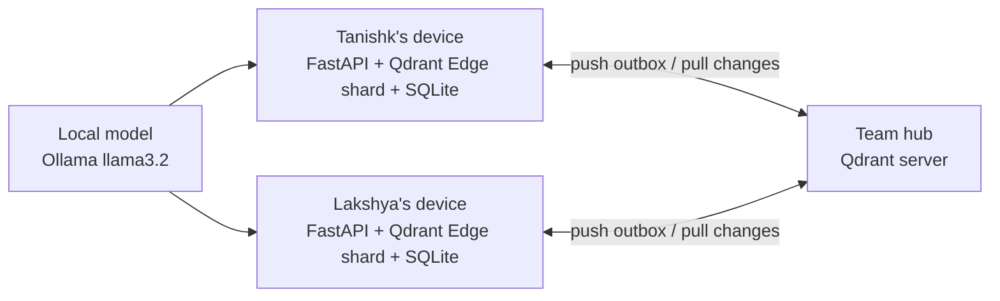

# Quorum: Offline-First Team Memory on Qdrant Edge

> **Your team's memory, on every laptop, even with no signal.**
> It reads everything, and nothing leaves unless it's work your team needs.
> When two people disagree about a deadline, it asks instead of guessing.

**Code Cubicle 6.0 · Problem Statement 03: AI-Powered Edge Memory & Intelligence (Qdrant Edge)**

🎬 **Showcase video:** linked in our submission (Google Drive). The film is generated from code in [`video/`](video/); see [Repository layout](#repository-layout).

---

## The problem

Small field teams (film crews, event teams, agencies, site crews) juggle many clients across email, WhatsApp and conversations on set, often somewhere with no network. A deadline gets changed in one place and misquoted in another. Nobody notices until it's too late.

Cloud assistants don't help here. They need a connection, and to be useful they would have to read everything: your email, your chats, what's on your screen. That data shouldn't leave the device.

## What Quorum is

**A shared, offline-first memory layer for small teams.** Each member's laptop is a full edge node:

- **Remembers** what each person was told (email, WhatsApp exports, typed notes), and every fact is stored as a **claim with a source**, never as bare truth.
- **Works with zero signal.** Hybrid search, extraction and answers all run on-device.
- **Syncs when it reconnects** through a persistent outbox that survives restarts.
- **Never silently picks a winner.** When two teammates' facts disagree, Qdrant surfaces the conflict and the task's owner resolves it.

Each member uses it through a personal assistant built on top of the layer. The **memory layer is the submission**; the assistant is the showcase.

## Architecture (as built for the online round)



For the online round both devices run on one machine as two separate processes, each with its own Qdrant Edge shard and SQLite file, shown side by side on one demo stage (`/stage`). "Offline" is a per-device switch that blocks that device's hub traffic at the transport; search, extraction and memory keep working. Two laptops with real airplane mode come after the elimination round.

| Component | Runs on | Stack |
| --- | --- | --- |
| Device app | Each device | FastAPI per device; vanilla JS UI (`app/web/`), live over SSE |
| Vector memory | Each device | `qdrant-edge-py` 0.8.0: one Edge shard per device |
| Embeddings | Each device | FastEmbed `bge-small-en-v1.5` (dense) + Qdrant Edge's built-in BM25 (sparse) |
| Outbox, conflicts, activity | Each device | SQLite, persistent across restarts |
| Extraction | Each device | Ollama `llama3.2`, JSON mode with the schema in the prompt and validation in Python; regex fallback; dates resolved in code |
| Sync hub | Same machine (demo) | Qdrant server 1.19 binary; holds only *team* and *my devices* claims |

Interfaces and as-built notes: [`app/CONTRACT.md`](app/CONTRACT.md). A full walkthrough of the demo and its mechanics is in `docs/WALKTHROUGH.md`.

## Memory model: claims, not facts

Every memory is a claim with a source: entity, attribute, value, who said it, who captured it, where and when, tier and status. Superseded claims are kept, so history stays traceable.

Each claim is a Qdrant point with three named vectors:

| Vector | Built from | Used for |
| --- | --- | --- |
| `text` | the claim sentence | meaning in hybrid search; position in the memory cloud |
| `bm25` | the claim sentence | keywords in hybrid search |
| `key` | entity + attribute, never the value | conflict detection |

### Qdrant does the conflict detection
For every new claim (typed locally or pulled from the hub), a dense nearest-neighbour query on `key`, filtered to the same attribute, live claims and not itself, with a 0.82 threshold, returns claims about the same thing. One with a different value (and a shared distinctive word in the names) opens a conflict. Both devices derive the same conflict id from the pair, so they agree without coordinating. Measured: "Sharma delivery due date" vs "Sharma edit due date" = 0.899; an unrelated deadline = 0.738.

### Qdrant enforces privacy
Team view adds a payload filter on tier to the Qdrant query. The sync outbox refuses device-only claims, the push step refuses them again, and the pull filter only takes team claims (or my-devices claims I captured).

## Tiers

| Tier | Stored on | Syncs to | Examples |
| --- | --- | --- | --- |
| Device only | This device | Nowhere | Salary, a friend's private news |
| My devices | My devices + hub | My other devices | Birthdays, personal schedule |
| Team | All team devices + hub | Whole team | Client deadlines, deliverables, shoots |

Everything starts device-only. Rules on the extracted claim decide when it's clearly team work; anything unsure stays on the device, and a follow-up never gets a wider tier than its entity already has.
**Up-sync:** a persistent outbox drained by a background worker with retries, oldest change first. **Down-sync:** each device scrolls the hub for claims changed since its cursor.

## Conflict handling

- Detected **at ingest** and **at sync**, by the same function.
- The **task owner** resolves. While a conflict is open, answers lead with both versions and their sources: *"Disputed: the client's email says 16 Oct; Tanishk's note from the call says 18 Oct."*
- A teammate who isn't the owner can draft a message to the owner (email or WhatsApp link); the app never sends anything itself.
- On resolution the chosen claim stays active, the other is superseded, and a resolution claim syncs so every device applies it.

## Real vs mocked (we're upfront about this)

| Real | Mocked or not built yet |
| --- | --- |
| Qdrant Edge memory + hybrid search on each device | Phone app, live WhatsApp stream, screen understanding |
| Qdrant-driven conflict detection, at ingest and at sync | Gmail API (a fixture inbox stands in) |
| Hub sync with a persistent outbox; per-device offline switch | Two physical laptops (one machine for the online round) |
| Owner resolution that syncs; tier privacy | Partial-snapshot sync, encryption at rest, voice, proactive nudges |
| Local extraction with sources; cited answers | |

## Status

**Elimination round MVP:** the two-device demo runs end to end (`scripts/demo.ps1`, checked by `scripts/demo_check.py`); the landing page is in `site/`.

## Repository layout

| Path | What it is |
| --- | --- |
| `app/` | The product: device app (`app/edge`), UI and demo stage (`app/web`), fixtures, tests |
| `scripts/` | `demo.ps1` (run the demo), `demo_check.py` (end-to-end check), `env.ps1` (repo-local caches), hub fetch |
| `site/` | The landing page (open `site/index.html`) |
| `docs/` | `MVP.md` (plan), `ROADMAP.md`, walkthrough |
| `deck/` | Pitch deck (`Quorum-Pitch.pptx`) and its generator |
| `video/` | The showcase film as code |

Run the demo (Windows, PowerShell):

```powershell
.\scripts\fetch_hub.ps1        # once: Qdrant server binary
.\scripts\demo.ps1             # hub + two seeded devices; prints the stage URL
app\.venv\Scripts\python scripts\demo_check.py
.\scripts\demo.ps1 -Stop
```

To rebuild the film (needs Node, Chrome, ffmpeg and Python with numpy/scipy):

```sh
cd video
npm install                  # puppeteer-core
python audio/compose.py      # -> audio/soundtrack.wav
node render.js               # -> out/quorum-v3.mp4 (about 8 min with 8 workers)
```

Rendered video and audio are kept out of git; the film is distributed via the submission link.

## Team

Tanishk (memory, sync, conflicts) · Tushar (frontend, visuals) · Aayat · Lakshya

## References

[Qdrant Edge docs](https://qdrant.tech/documentation/edge/) · [Edge data synchronization patterns](https://qdrant.tech/documentation/edge/edge-data-synchronization-patterns/)
